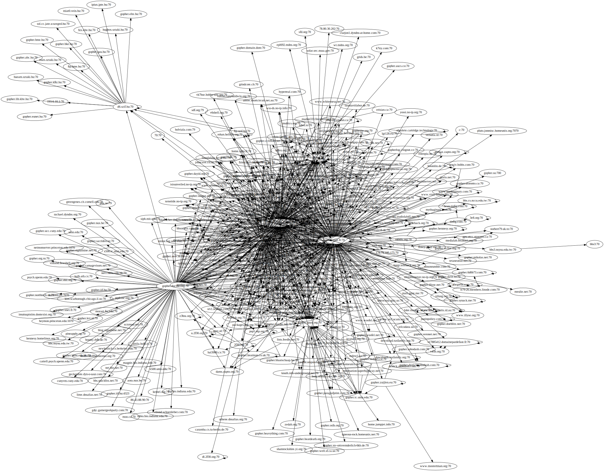
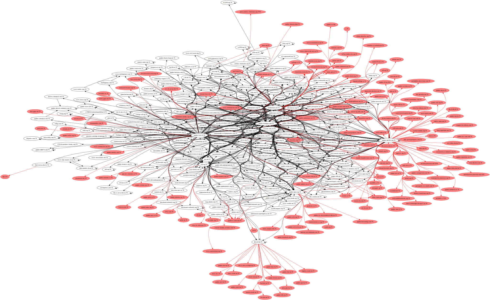
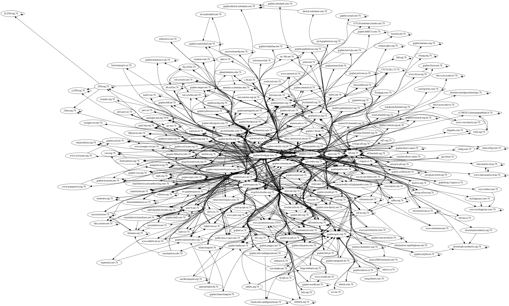

grawler
=======

A gopherspace crawler
---------------------

### What is it?

`grawler` is a gopherspace crawler crawling all servers reachable (direct or
indirect) from a gopherhole used as starting point. By default `grawler` will
start crawling with gopher.floodgap.com, probably the most central gopherhole in
existence.

To crawl the whole gopherspace, `grawler` will need a few hours on a reasonable
fast computer and internet connection - todays gopherspace is not as big as it
used to be :(

### Installation

`grawler` is written in go. So you need a go environment and can install
`grawler` by calling

	go install github.com/blabber/grawler

### Let the grawling begin

To start the crawler just call `grawler`. It will issue log messages on stderr
and generate a file called `grawler.dot` that can be postprocessed using the
[graphviz](http://www.graphviz.org) graph visualization software.

### Results

You can find an example `grawler.dot` in the [results](./results) folder. If you
do something cool with this data or your own result sets, please let me know.

#### Statistics

	Gopherholes
	  alive:  228
	  dead:   162
	  total:  390
	
	Top 5 TLDs for alive gopherholes
	  .org   73
	  .net   41
	  .com   36
	  .de    9
	  .uk    5
	
	Top 5 TLDs for dead gopherholes
	  .org   33
	  .net   21
	  .hu    18
	  .edu   18
	  .com   13

#### Some graphs

##### Raw graph

This graph was generated using the following commands:

	sfdp -Tsvg -o graphs/raw.svg results/grawler.dot

##### All identified gopherholes, unresponsive ones colored red

This graph was generated using the following commands:

	gvpr -f tools/colorize.g results/grawler.dot | \
		sfdp -Tsvg -Goverlap=false -Gsplines=true -o graphs/colored.svg

##### All responsive gopherholes

This graph was generated using the following commands:

	gvpr -f tools/cleanup.g results/grawler.dot | \
		sfdp -Tsvg -Goverlap=false -Gsplines=true -o graphs/alive.svg

